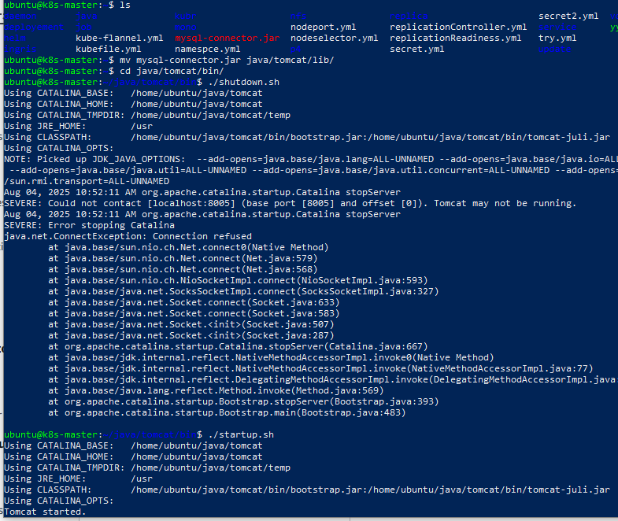
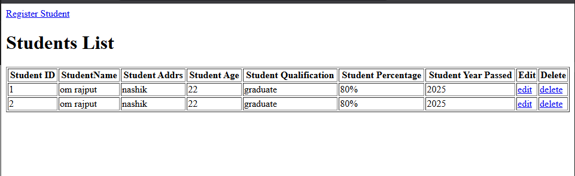
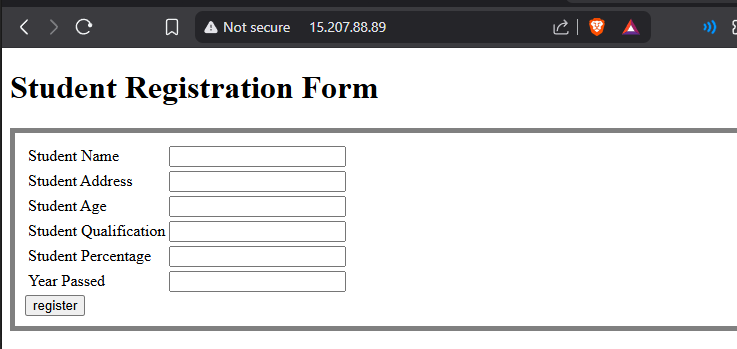

# 📦 Java Application Deployment on AWS with NGINX Reverse Proxy – Project Summary

---

## 📝 Detailed Deployment Report

### 1. Project Architecture & Traffic Flow

- **EC2 Instance 1 (Backend):**
  - Hosts Apache Tomcat with the deployed `student.war` Java web application.
  - Connects to an Amazon RDS MySQL database for data storage.
  - 

- **Amazon RDS (MySQL):**
  - Central managed database to persist student registration details.
  - `students` table is created and accessed by the Java application via JDBC.
  - 
  - 

- **EC2 Instance 2 (Proxy):**
  - Runs NGINX, configured as a reverse proxy.
  - Listens on port 80 and forwards HTTP requests to the backend Tomcat server's private IP and port 8080.
  - Only the proxy’s public IP is exposed externally, hiding backend details.
  - 

- **Traffic Flow:**
[User Browser]
↓
[Proxy Server (Nginx) -- HTTP/HTTPS on :80/:443]
↓
[Backend Server (Tomcat) -- Private IP :8080]
↓
[Amazon RDS MySQL Database]

text
Users access the application using the proxy server’s public IP or domain; requests are transparently forwarded to Tomcat, which handles business logic and database operations.

---

### 2. Step-by-Step Deployment Process

#### a. Provisioning AWS Resources
- Launched **two EC2 instances**:
1. Backend server for Tomcat + Java app.
2. Proxy server for NGINX.
- 
- Launched an **RDS MySQL instance**; created the `studentdb.students` table using SQL.
- 

#### b. Backend Deployment (Tomcat + WAR)
- Installed Java and Tomcat.
- Copied the `student.war` file to Tomcat’s `webapps` directory.
- Placed `mysql-connector-java-8.x.x.jar` in Tomcat’s `lib/` directory.
- 
- Configured the application with JDBC connection:
jdbc:mysql://<RDS-endpoint>:3306/studentdb

text
- Confirmed that direct access via backend’s port 8080 worked and could register/view students.
- 

#### c. Database Integration
- Created `students` table (fields: id, name, email, gender, city).
- 
- Ensured Tomcat reached RDS by adjusting RDS security groups for backend EC2’s private IP.
- Used MySQL CLI and application UI to verify records were inserted and retrieved properly.
- 

#### d. Proxy Server (NGINX) Setup
- Installed NGINX:
sudo apt update
sudo apt install nginx -y

text
- Configured `/etc/nginx/sites-available/default` with a `proxy_pass` location block:
server {
listen 80 default_server;
listen [::]:80 default_server;

text
  server_name _;

  location / {
      proxy_set_header Host $host;
      proxy_set_header X-Real-IP $remote_addr;
      proxy_set_header X-Forwarded-For $proxy_add_x_forwarded_for;
      proxy_set_header X-Forwarded-Proto $scheme;
      proxy_pass http://<BACKEND_PRIVATE_IP>:8080/;
      proxy_redirect off;
  }
}

text
- 
- Reloaded NGINX and confirmed public IP showed the Java application.
- 
- **Disabled direct public access to Tomcat** on security groups—only the proxy’s private IP allowed on port 8080.

---

### 3. Tools, Services, and Configurations Used

- **AWS EC2:** For hosting both backend and proxy servers.
- **Apache Tomcat:** Java Servlet container to deploy WAR.
- **Nginx:** As a reverse proxy to forward web traffic.
- **Amazon RDS (MySQL):** Managed relational database service.
- **MySQL Connector/J:** JDBC driver to connect Java app to MySQL.
- **MySQL CLI & Adminer:** For database administration and verification.
- **AWS Security Groups:** For network access control and restriction.

---

### 4. Issues Faced and How They Were Resolved

- **Port Conflict (Apache2 and NGINX):**  
Apache2 was already listening on port 80, blocking NGINX from starting.  
*Solution:* Stopped, disabled, and masked Apache2 service to free port 80 for NGINX:
sudo systemctl stop apache2
sudo systemctl disable apache2
sudo systemctl mask apache2
sudo systemctl restart nginx

text

- **JNDI DataSource Lookup Errors:**  
Application could not find JNDI datasource due to missing resource references and Tomcat configuration.  
*Solution:* Added Resource configuration in Tomcat’s `context.xml` and matching `<resource-ref>` in application `web.xml`.

- **Database Table Name Mismatch:**  
SQL queries in Java referred to incorrect table names.  
*Solution:* Aligned Java code insert/update queries to correct `students` table schema.

- **Network Connectivity to RDS:**  
Backend EC2 was initially unable to reach RDS port.  
*Solution:* Updated AWS Security Group inbound rules to allow MySQL (3306) traffic from backend EC2.

- **Nginx Installation and Service Start:**  
Nginx initially failed to start due to partial install or package conflicts.  
*Solution:* Reinstalled Nginx cleanly, verified status, and confirmed it was listening on port 80.

---

### 5. Final Result

- **Publicly reachable student registration app** secured behind Nginx proxy.
- Data persisted robustly in AWS RDS MySQL with correct schema.
- Full traffic flow and deployment automated using industry best practices.

---

### 6. Screenshots and Reference Links

- 
- 
- 
- 
- 
- 
- 
- 

---
