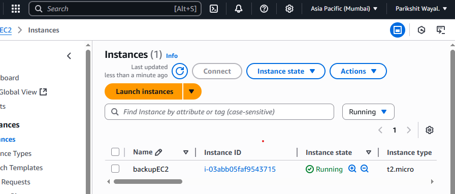
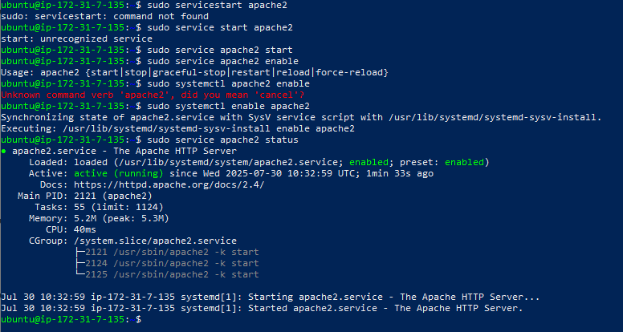
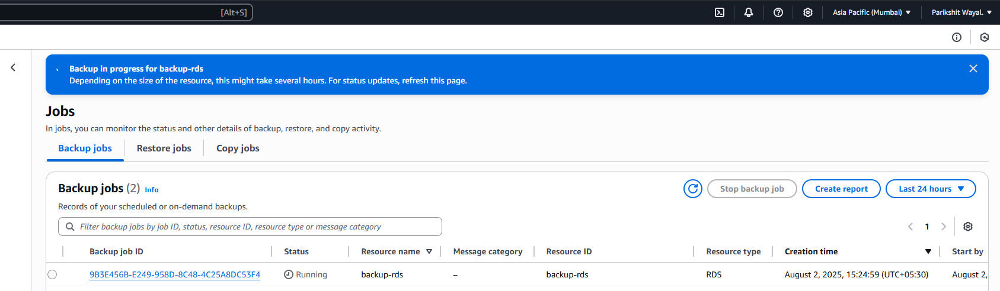
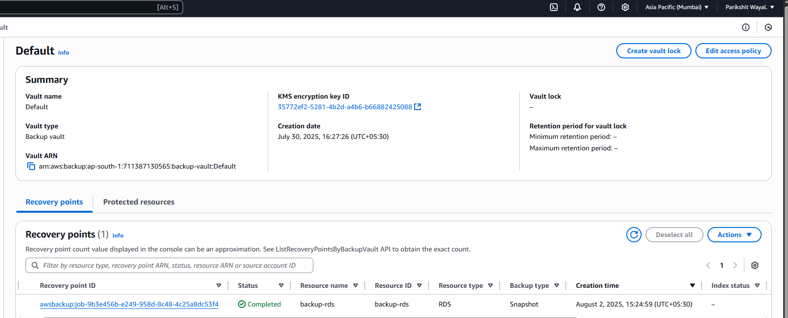

# 📦 AWS Backup for EC2 and RDS – Project Summary

---

## 📸 Screenshots

**EC2 Instance Running:**  

**Apache/Web Server Running:**  

**Browser Access to EC2 Web Server:**  

**RDS Instance Running and Database Ready:**  

**Sample Data Created and Tested in RDS:**  

**Backup Plan Configuration:**  

**Backup Jobs (EC2 & RDS):**  

**Backup Vault Showing Recovery Points (RDS):**  

---

## 📝 Short Report

### 1. Steps Taken to Set Up the Backup

- **Provisioned resources:**
  - Launched an EC2 instance (Amazon Linux 2), installed Apache, and confirmed browser access with a custom HTML page.
  - Created an RDS database (MySQL), established test database (`backup_test`), and inserted sample records.
- **Configured AWS Backup:**
  - Opened AWS Backup in the AWS Console.
  - Created (or used default) Backup Vault.
  - Built a new Backup Plan with daily backup rule and 7-day retention.
  - Assigned both EC2 and RDS resources directly to the plan.

- **Validated:**
  - Triggered on-demand backups for both resources.
  - Monitored Backup Jobs until completion.
  - Located and verified recovery points for EC2 and RDS in the Backup Vault.

---

### 2. Key Configuration Details

- **Backup frequency:** Daily
- **Retention period:** 7 days (set during backup rule creation)
- **Vault used:** Default backup vault (no custom vault needed for the demo)
- **Rule name:** daily-backup-rule
- **Resource assignment:** Direct assignment of both EC2 and RDS resources by ID

---

### 3. Tools and AWS Console Sections Used

- **EC2 Console:** For instance creation, SSH, and web server validation.
- **RDS Console:** For creating the DB instance and managing test data.
- **AWS Backup Console:**
  - **Backup Vaults** – for vault selection and recovery points
  - **Backup Plans** – to create the plan and assign resources
  - **Protected Resources** – to confirm resource association and view backups
  - **Backup Jobs** – to monitor backup progress and status

---

### 4. Issues Faced and How They Were Resolved

- **Issue:** Confusion over image preview/linking when writing up screenshots in markdown  
  **Solution:** Used `./screenshots/imagename.png` relative links for flawless GitHub display.

- **Issue:** Waiting for backup jobs to complete for sizable RDS snapshots  
  **Solution:** Monitored the Backup Jobs page and proceeded only after receiving "Completed" status.

- **Issue:** Navigating AWS Backup plan creation steps (e.g., direct vs tag-based resource assignment)  
  **Solution:** Used direct resource assignment by ID for clarity and certainty in this project context.

---

**Result:**  
Both the EC2 and RDS resources are protected by an automated, centralized AWS Backup plan, with verified on-demand and scheduled recoverability, achieving robust disaster recovery best practices!

---

