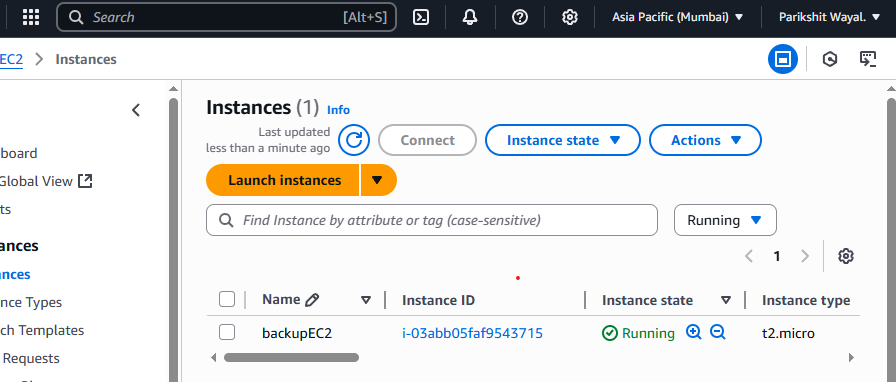
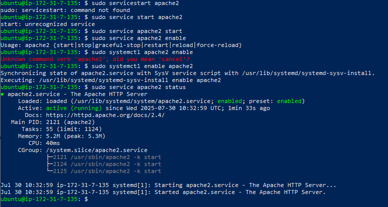
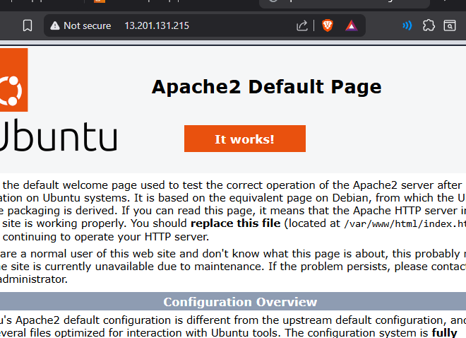
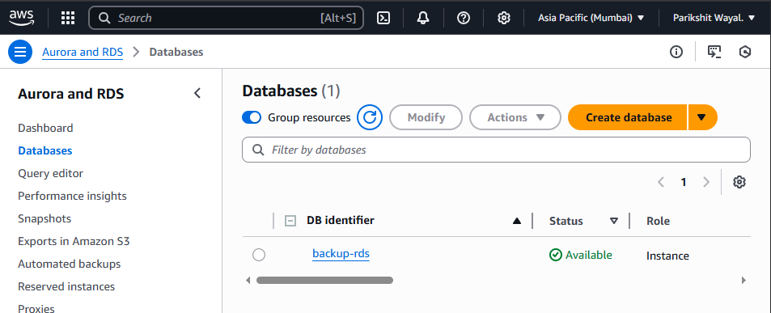
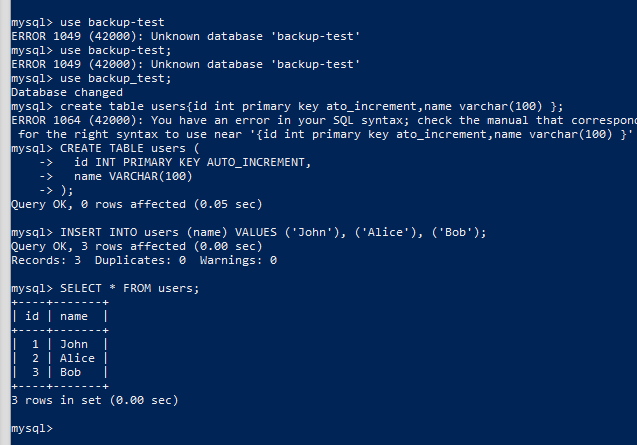
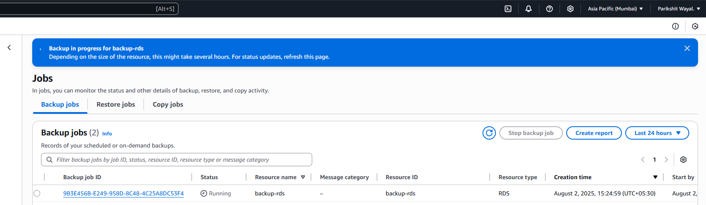
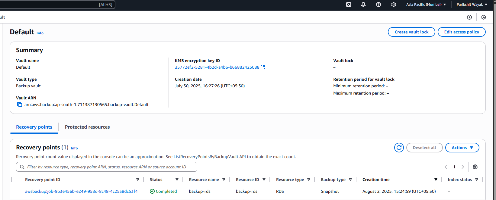
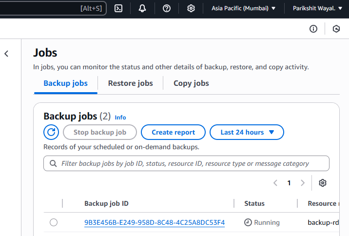

# images 
## 📸 Screenshots

**EC2 Instance Created:**  

**Apache/Web Server Running:**  

**Browser Access to Web Server:**  

**RDS Instance and Database Ready:**  

**Test Data Created and Verified:**  

**AWS Backup Vault with Recovery Points:**  

**Backup Job for EC2 and RDS:**  

