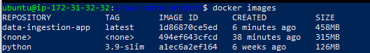
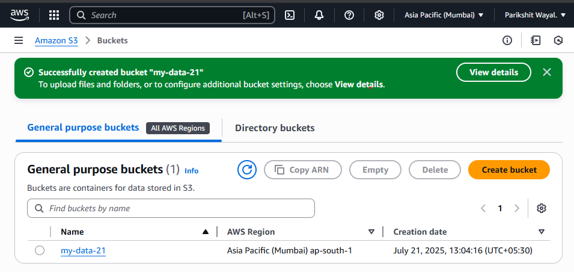
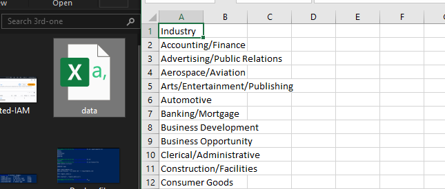
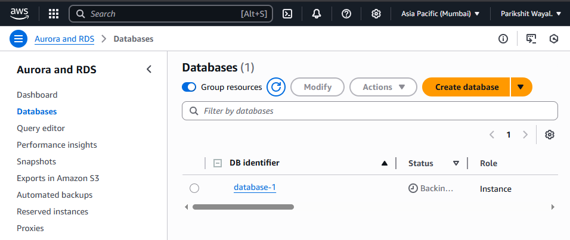
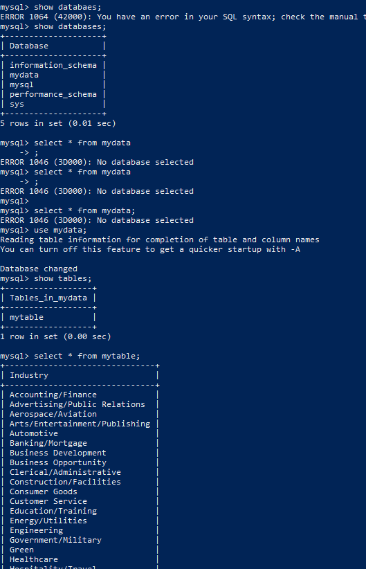
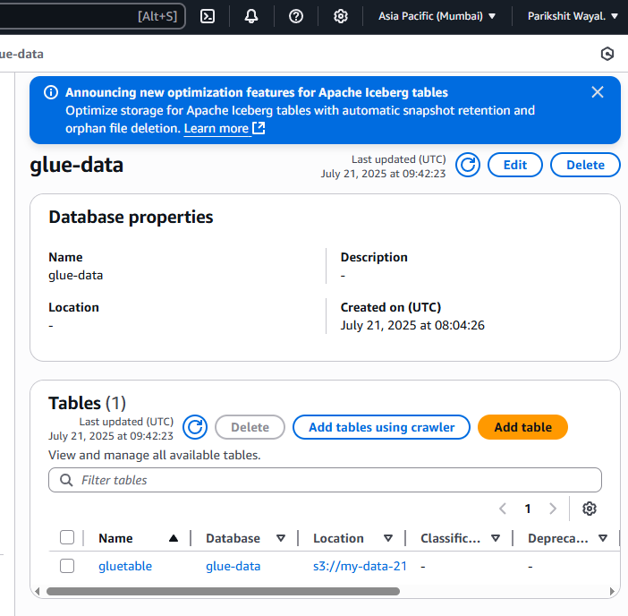
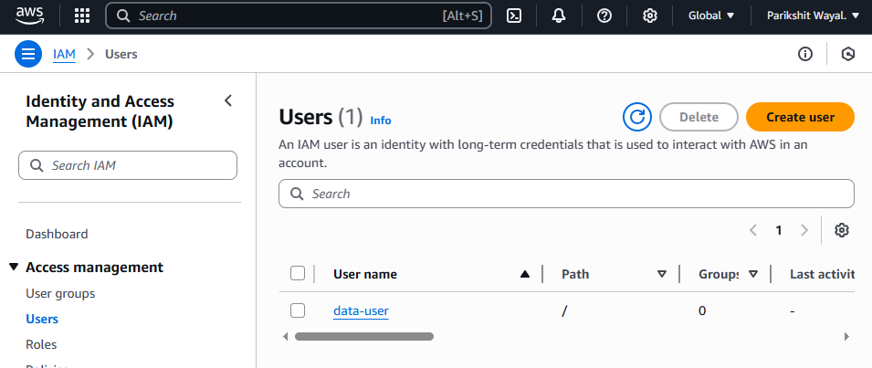

# 📊 Data Ingestion from S3 to RDS with Fallback to AWS Glue using Dockerized Python Application

## 🧩 Overview

This project demonstrates a robust data ingestion pipeline that:
- Ingests a CSV file from an **S3 bucket**
- Attempts to store the data in an **RDS MySQL database**
- Falls back to storing the data in **Parquet format in S3** and registers it in **AWS Glue Data Catalog** if RDS fails

> Built using Python, Docker, Boto3, Pandas, SQLAlchemy, and AWS services.



---

## ✅ Architecture Flow

1. **Data Source**: CSV file stored in S3 bucket.
2. **Primary Ingestion Target**: RDS MySQL instance.
3. **Fallback Target**: Parquet format in S3 → Registered in AWS Glue.
4. **Containerized Execution**: Docker used to package and run the ingestion script.

---

## 🔧 Setup Steps

### 1. 🪣 S3 Bucket Setup
- Created bucket: `my-data-21` (region: `ap-south-1`)
- Uploaded sample file: `data.csv`




---

### 2. 🛢️ RDS Database Setup
- Created MySQL RDS instance (`db.t4g.micro`, publicly accessible)
- DB name: `mydata`
- Connected via EC2 MySQL client to configure schema.




---

### 3. 🔄 AWS Glue Setup (Fallback)
- Created Glue DB: `glue-data`
- Created fallback path in S3: `s3://my-data-21/glue-data/`



---

### 4. 🔐 IAM Configuration
- IAM User: `data-user` with **Programmatic Access**
- Policies attached:
  - AmazonS3FullAccess
  - AmazonRDSFullAccess
  - AWSGlueConsoleFullAccess



---

## 🐍 Python Code Structure

Directory:
aws-data-project/
├── ingest_data.py
├── requirements.txt
└── Dockerfile

yaml
Copy
Edit

### ✅ `ingest_data.py` Highlights:
- Uses `boto3` to read from S3
- Parses CSV using `pandas`
- Uploads to RDS using `SQLAlchemy`
- On failure:
  - Converts data to Parquet
  - Uploads to S3
  - Registers Glue table using `boto3`

---

## 🐳 Docker Setup

### 1. Dockerfile
```Dockerfile
FROM python:3.9-slim
WORKDIR /app
COPY . .
RUN pip install -r requirements.txt
CMD ["python", "ingest_data.py"]

2. Build Docker Image

docker build -t data-ingestion-app .

3. Run the Docker Container

docker run -e AWS_ACCESS_KEY_ID=your_key \
           -e AWS_SECRET_ACCESS_KEY=your_secret \
           -e AWS_REGION=ap-south-1 \
           -e S3_BUCKET=my-data-21 \
           -e S3_KEY=data.csv \
           -e RDS_HOST=your-rds-endpoint \
           -e RDS_USER=admin \
           -e RDS_PASS=your_password \
           -e RDS_DB=mydata \
           -e GLUE_DB=glue-data \
           -e GLUE_TABLE=mytable \
           -e GLUE_S3_PATH=s3://my-data-21/glue-data/ \
           data-ingestion-app

✅ Test Results
Scenario	Result
✅ Valid RDS credentials	Data inserted into RDS successfully


🔍 Verification Steps
Connected to RDS using:

sql

USE mydata;
SELECT * FROM mytable;
Verified table schema in AWS Glue Console.

🧹 Cleanup

# Stop RDS to avoid cost
# Delete S3 objects and Glue table
docker system prune -a
