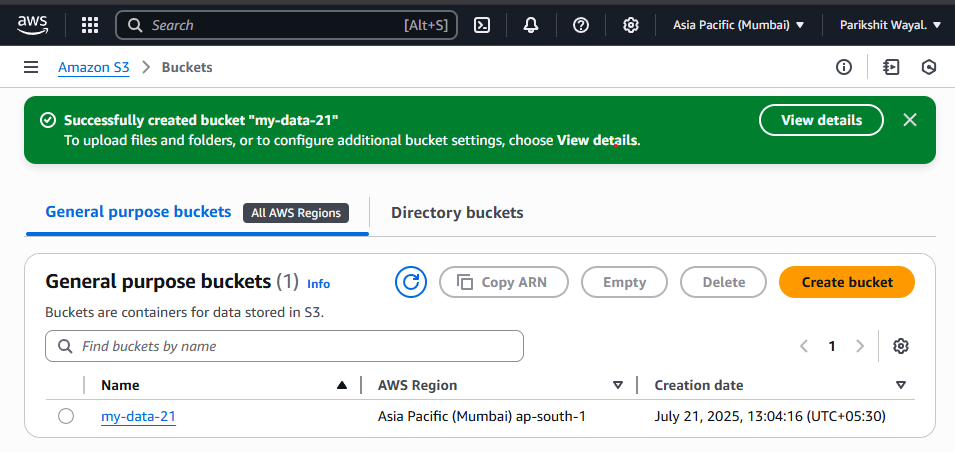
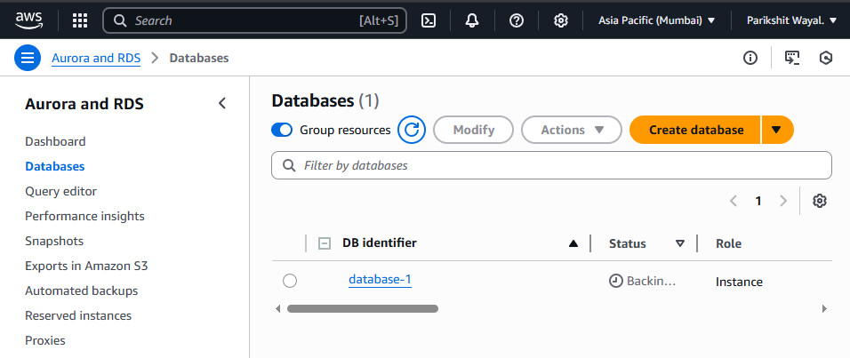
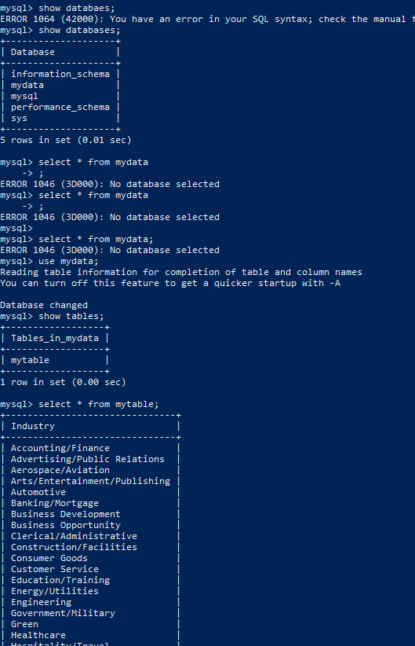

#images

Project Architecture Diagram
Shows the overall data ingestion workflow from S3 → RDS → fallback to Glue using Docker.

Dockerfile Screenshot
Displays the Dockerfile used to build the Python ingestion app image.

S3 Bucket Created
Screenshot of the S3 bucket my-data-21 created in the Mumbai region.

CSV File Uploaded to S3
Shows the data.csv file uploaded to the S3 bucket.

IAM User with Permissions
Displays the IAM user data-user created with programmatic access and policies attached.

Docker Run Command Execution
Screenshot of the Docker container execution using environment variables.

RDS MySQL Instance Created
Shows the created RDS MySQL instance with public access enabled.

RDS Access via MySQL CLI
Screenshot of connecting to the RDS instance and verifying the data insertion.

AWS Glue Table Created
Confirms that fallback data was registered in the Glue Data Catalog successfully.

