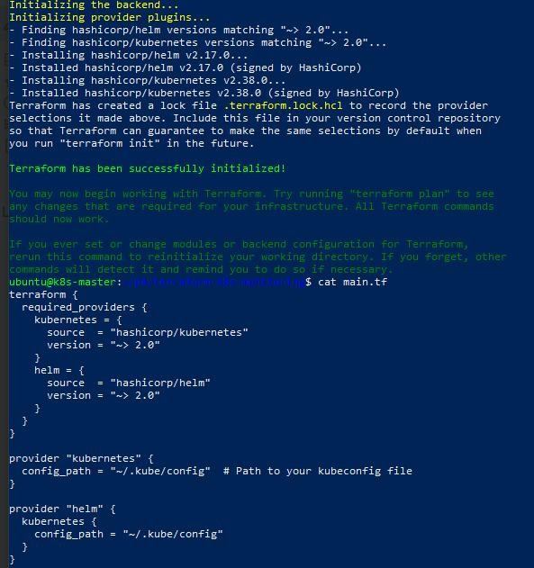

- Completed Terraform provisioning for infrastructure  
  

- Installed Prometheus and Grafana using Helm  
  

- Accessed Grafana UI through NodePort  
  

- Accessed Prometheus UI through NodePort  
  

- Added Prometheus as a data source in Grafana  
  

- Created CPU usage panel per pod/service in Grafana  
  

- Final Grafana dashboard with monitoring widgets  
  
