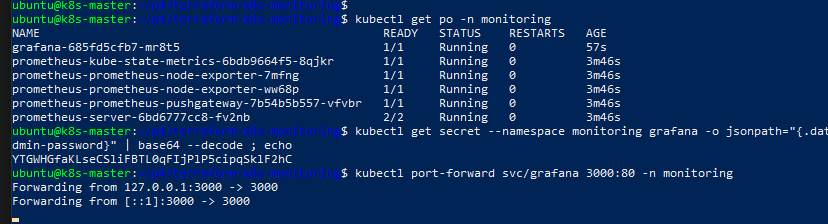
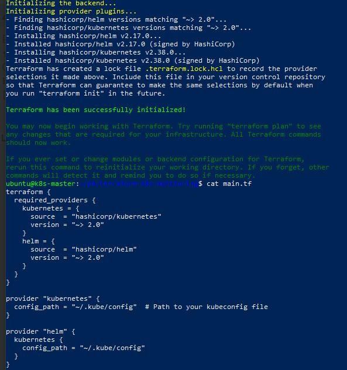
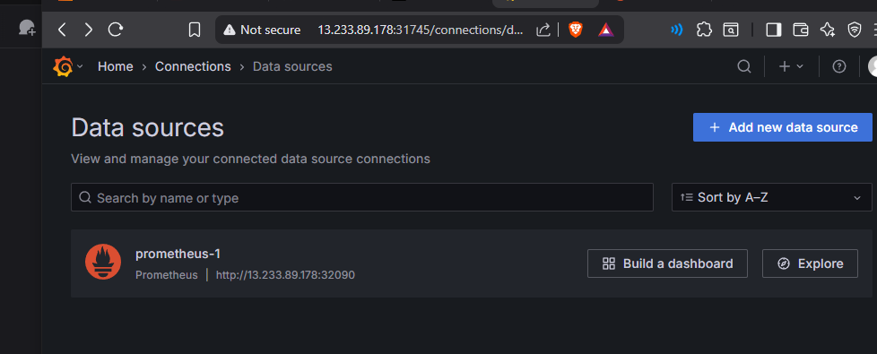
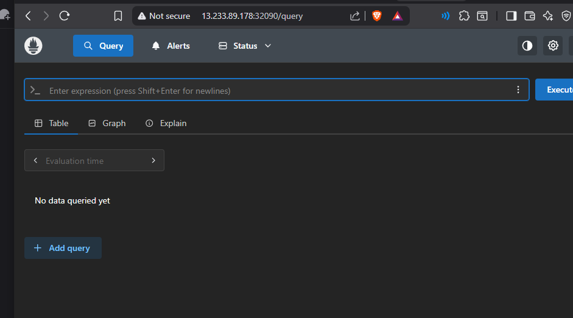
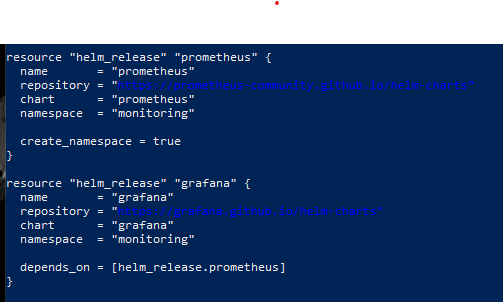
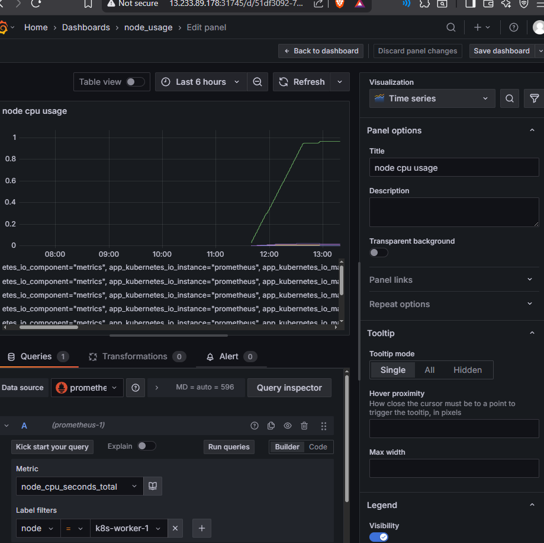
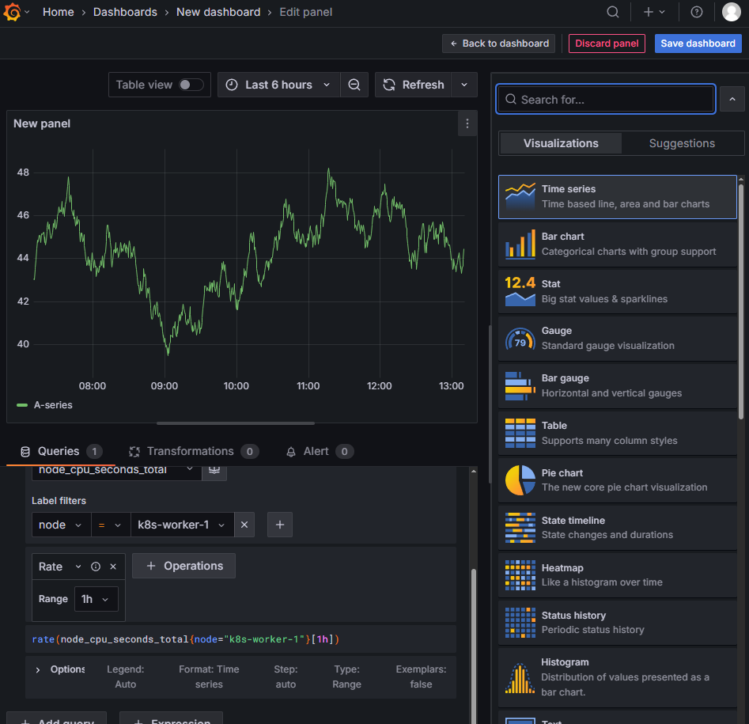

# 📸 Screenshots

*Terraform provisioning completed*

---

*Prometheus and Grafana installed via Helm*

---

*Grafana web UI opened via NodePort*

---

*Prometheus web UI opened via NodePort*

---

*Prometheus connected as data source in Grafana*

---

*CPU usage graph panel per pod/service*

---

*Custom Grafana dashboard for monitoring*

