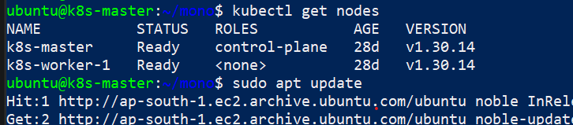
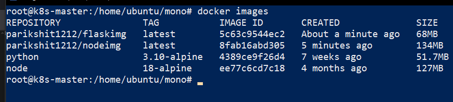
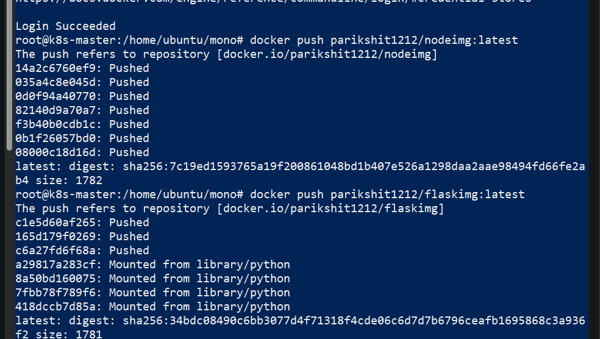
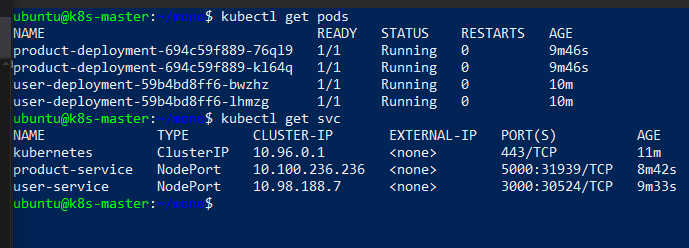
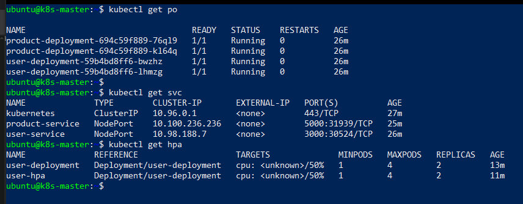
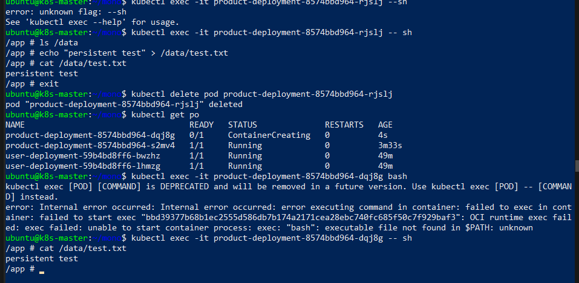

# 🚀 Project 5: Deploy and Run Microservices on Kubernetes — With Scaling & Persistence

A concise summary and documentation for building a microservices architecture on Kubernetes from scratch, including **autoscaling** and **persistent storage**.

---

## 📌 Overview

This project demonstrates the migration of a sample application to a microservices model using:

- ☸️ **Kubernetes** for orchestration, scaling, and service discovery  
- 🛢️ **Persistent Volumes (PV/PVC)** for data durability  
- 📦 **Docker** to containerize Node.js and Flask microservices  
- 🔗 **Horizontal Pod Autoscaler (HPA)** for dynamic scaling  
- 🖥️ **AWS EC2** to provide the infrastructure (1 Master, 1 Worker Node)  
- 🌐 **NodePort Services** for easy access from outside the cluster  

---

## 🧱 Step-by-Step with Screenshots

### ✅ 1. Cluster Ready  
Kubernetes master and worker nodes launched and joined.  
`kubectl get nodes` confirms cluster health.  

---

### 📦 2. Dockerize and Push Microservices  
Both user (Node.js) and product (Flask) services containerized and pushed to Docker Hub.  

---

### ☸️ 3. Deployments and Services in Kubernetes  
Created deployment and service manifests for both microservices, exposing them on unique NodePorts.  

---

### 📈 4. Autoscaling with HPA  
Set up Horizontal Pod Autoscaler (HPA) for the user service to automatically adjust replica count.  
Service endpoints and HPA observed to be operational.  

---

### 🛢️ 5. Persistent Storage with PV/PVC  
Mounted a PersistentVolumeClaim (PVC) into the product (Flask) pod.  
Demonstrated file persistence across pod restarts.  

---

## 🧰 Infrastructure & Tools Used

| Component     | Description                                  |
|---------------|----------------------------------------------|
| 🖥️ EC2         | Master and worker nodes for cluster          |
| ☸️ Kubernetes  | Orchestration & microservices architecture   |
| 🐳 Docker      | Containerizes the user & product services    |
| 🔗 Docker Hub  | Stores/publishes built images                |
| 📜 YAML        | Declarative app/service definitions          |
| 📈 HPA         | Automatically scales user service pods       |
| 📂 PV/PVC      | Data persistence for Flask (product) service |

---

## 🔧 What I Did

- Built simple Node.js and Flask applications for demo microservices  
- Wrote Dockerfiles and created images locally  
- Pushed images to Docker Hub for cluster access  
- Authored YAML manifests for Deployments and Services  
- Applied manifests via `kubectl apply -f ...`  
- Created HPA for user service, scaling between 1 and 4 pods on CPU load  
- Set up PersistentVolume and PersistentVolumeClaim for product service  
- Demonstrated file persistence by writing to `/data` in the pod, deleting it, and verifying file survived in new pod

---

## ✅ Key Success Checks

- ✅ Both microservices deployed and reported `Running` status in Kubernetes  
- ✅ NodePorts allowed direct browser and curl access to `/health` endpoints  
- ✅ HPA automatically spawned new pods on simulated load  
- ✅ File written to `/data` (via PVC) survived after product pod deletion  
- ✅ All changes tracked as declarative YAML, fully repeatable

---

## 📚 What I Learned

- How to go from raw EC2 nodes to a fully functioning, scalable, and persistent Kubernetes microservices environment  
- The importance of correct build context and manifest details for Docker/K8s workflows  
- How HPA, PVC, and proper Service definitions unlock real-world production patterns  
- Troubleshooting techniques for CrashLoopBackOff, missing mounts, and exec errors in minimal containers

---

⭐ *Cloud-native microservices, scaled and persistent, deployed with confidence by me!*
